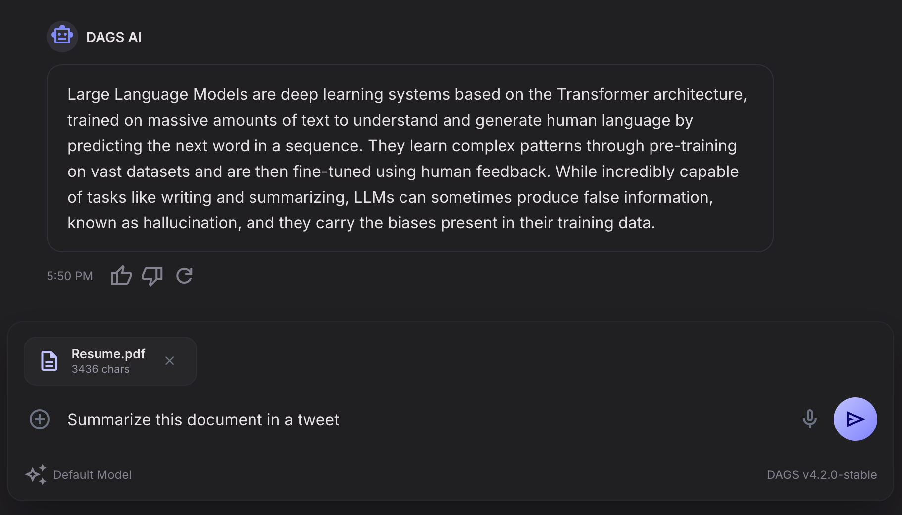

# DAGS



## Your Private AI Workspace

DAGS is a personal AI assistant you can run yourself. It gives you a clean chat experience where you can ask questions, upload documents, summarize content, generate translations, and keep useful conversations in one place.

Instead of sending every interaction to a hosted service you do not control, DAGS is designed to bundle the app, the API, and the database together so you can launch a complete AI workspace from a single deployment. Bring your own local Ollama models, create an account, and start using AI on your own terms.

What it helps you do:

- Chat with an AI assistant through a focused web interface
- Upload documents and ask for summaries or explanations
- Translate and rework text without leaving the app
- Keep conversation context backed by a local database
- Run the whole stack in one container for easier self-hosting

## Technical Overview

DAGS packages three services into one deployment image:

- `dags` front-end (TanStack Start)
- `dags-api` back-end (Spring Boot)
- PostgreSQL 17 with `pgvector`

The front-end is preconfigured to talk to the back-end inside the same container, and the back-end is preconfigured to talk to the bundled PostgreSQL instance.

Authentication is mandatory:

- access tokens live for `5 minutes`
- refresh tokens live for `3 days`
- the front-end checks authentication on the server before rendering protected routes
- users land on a login screen until they authenticate
- account creation is controlled by `AUTH_REGISTRATION_ENABLED`, which defaults to `false`

The default deployment path is a single `docker run` command.

## Architecture

- Front-end HTTP server: `3000`
- Back-end API: `8080`
- PostgreSQL: `5432`
- Persistent database volume: `/var/lib/postgresql/data`

At runtime:

1. PostgreSQL starts with a persistent data directory.
2. The container ensures the configured database and user exist.
3. The container enables `pgvector` in the bundled database.
4. The Spring Boot app starts and runs Flyway migrations.
5. The front-end starts and proxies its server-side API calls to the local back-end using JWT-backed secure cookies.

## Build The Image

From the repository root:

```bash
docker build -t dags-all-in-one .
```

## Run The Container

The simplest local deployment:

```bash
docker run -d \
  --name dags \
  -p 3000:3000 \
  -p 8080:8080 \
  -p 5432:5432 \
  -v dags_data:/var/lib/postgresql/data \
  -e SPRING_AI_OLLAMA_BASE_URL=http://host.docker.internal:11434 \
  dags-all-in-one
```

Then open:

- Front-end: `http://localhost:3000`
- Back-end: `http://localhost:8080`
- PostgreSQL: `localhost:5432`

Notes:

- `SPRING_AI_OLLAMA_BASE_URL` is the main required external dependency if you want chat and translation generation to work.
- On Linux, replace `host.docker.internal` with an address reachable from the container.
- Keep the volume mount if you want PostgreSQL data to survive container recreation.
- Since `AUTH_REGISTRATION_ENABLED=false` by default, no user can sign up until you explicitly enable registration.

## First Account Creation

Registration is disabled by default.

For the first deployment, enable registration temporarily, create an account from the login screen, and then disable registration again.

Example first boot:

```bash
docker run -d \
  --name dags \
  -p 3000:3000 \
  -p 8080:8080 \
  -p 5432:5432 \
  -v dags_data:/var/lib/postgresql/data \
  -e AUTH_REGISTRATION_ENABLED=true \
  -e AUTH_TOKEN_SECRET=replace-with-a-long-random-secret \
  -e SPRING_AI_OLLAMA_BASE_URL=http://host.docker.internal:11434 \
  dags-all-in-one
```

After creating the first account, restart with registration disabled:

```bash
docker rm -f dags

docker run -d \
  --name dags \
  -p 3000:3000 \
  -p 8080:8080 \
  -p 5432:5432 \
  -v dags_data:/var/lib/postgresql/data \
  -e AUTH_REGISTRATION_ENABLED=false \
  -e AUTH_TOKEN_SECRET=replace-with-the-same-long-random-secret \
  -e SPRING_AI_OLLAMA_BASE_URL=http://host.docker.internal:11434 \
  dags-all-in-one
```

## Optional Docker Compose

```yaml
services:
  dags:
    image: dags-all-in-one
    build: .
    ports:
      - "3000:3000"
      - "8080:8080"
      - "5432:5432"
    volumes:
      - dags_data:/var/lib/postgresql/data
    environment:
      AUTH_TOKEN_SECRET: replace-with-a-long-random-secret
      AUTH_REGISTRATION_ENABLED: "false"
      SPRING_AI_OLLAMA_BASE_URL: http://host.docker.internal:11434

volumes:
  dags_data:
```

## Runtime Configuration

### Deployment Variables

These variables control the bundled services in the image.

| Variable | Default | Purpose |
| --- | --- | --- |
| `FRONTEND_HOST` | `0.0.0.0` | Host binding for the front-end server |
| `FRONTEND_PORT` | `3000` | Port used by the front-end server |
| `BACKEND_PORT` | `8080` | Port used by the Spring Boot API |
| `POSTGRES_PORT` | `5432` | Port used by PostgreSQL |
| `POSTGRES_LISTEN_ADDRESSES` | `0.0.0.0` | PostgreSQL listen addresses |
| `PGDATA` | `/var/lib/postgresql/data` | PostgreSQL data directory |
| `POSTGRES_DB` | `dags` | PostgreSQL database name |
| `POSTGRES_USER` | `dags` | PostgreSQL application user |
| `POSTGRES_PASSWORD` | `dags` | PostgreSQL application password |

### Front-End Variables

These are read by the TanStack Start server process.

| Variable | Default In Container | Purpose |
| --- | --- | --- |
| `AI_TOOLS_API_BASE_URL` | `http://127.0.0.1:${BACKEND_PORT}/api/v1` | Base URL used by the front-end server to call the back-end |
| `AUTH_REGISTRATION_ENABLED` | `false` | Same registration flag used by both the front-end and back-end |
| `HOST` | `FRONTEND_HOST` | Alternate host binding override for Nitro/TanStack Start |
| `PORT` | `FRONTEND_PORT` | Alternate port override for Nitro/TanStack Start |
| `NITRO_HOST` | `HOST` | Nitro-specific host override |
| `NITRO_PORT` | `PORT` | Nitro-specific port override |

You usually do not need to set any of these manually in the all-in-one container, since the image links the front-end to the local back-end automatically.

### Back-End Variables

These variables configure the Spring Boot app and are the main knobs for behavior changes.

| Variable | Default | Purpose |
| --- | --- | --- |
| `SERVER_PORT` | `BACKEND_PORT` | Spring Boot HTTP port |
| `SPRING_DATASOURCE_URL` | `jdbc:postgresql://127.0.0.1:${POSTGRES_PORT}/${POSTGRES_DB}` | JDBC URL |
| `SPRING_DATASOURCE_USERNAME` | `POSTGRES_USER` | JDBC username |
| `SPRING_DATASOURCE_PASSWORD` | `POSTGRES_PASSWORD` | JDBC password |
| `AUTH_REGISTRATION_ENABLED` | `false` | Enables or disables account creation in both apps |
| `AUTH_ACCESS_TOKEN_TTL_SECONDS` | `300` | Access token lifetime |
| `AUTH_REFRESH_TOKEN_TTL_SECONDS` | `259200` | Refresh token lifetime |
| `AUTH_TOKEN_SECRET` | `change-me-in-production-change-me-in-production` | HMAC secret used to sign JWT access tokens |
| `CHAT_DEFAULT_MODEL` | `SPRING_AI_OLLAMA_CHAT_OPTIONS_MODEL` or `gemma4:e4b` | Default chat model |
| `CHAT_PROMPT_SYSTEM` | built-in prompt | Main system prompt for chat |
| `CHAT_MEMORY_PROVIDER` | `postgres` in container | Chat memory storage provider |
| `CHAT_MEMORY_MAX_MESSAGES` | `20` | Max messages retained in chat memory window |
| `CHAT_DOCUMENTS_PROVIDER` | `pgvector` in container | Chat document storage provider |
| `CHAT_DOCUMENTS_MAX_CHARACTERS` | `200000` | Max extracted characters stored per document |
| `CHAT_DOCUMENTS_MAX_FILE_SIZE_BYTES` | `10485760` | Max upload size per document |
| `SPRING_AI_OLLAMA_BASE_URL` | `http://localhost:11434` | Ollama base URL |
| `SPRING_AI_OLLAMA_CHAT_OPTIONS_MODEL` | `gemma4:e4b` | Ollama chat model |
| `SPRING_AI_OLLAMA_EMBEDDING_OPTIONS_MODEL` | `nomic-embed-text` | Ollama embedding model |
| `TRANSLATION_PROMPT_SYSTEM` | built-in prompt | Translation system prompt |
| `SPRING_PROFILES_ACTIVE` | unset | Optional Spring profile override |

### Practical Examples

Run with a different PostgreSQL password and auth secret:

```bash
docker run -d \
  --name dags \
  -p 3000:3000 \
  -v dags_data:/var/lib/postgresql/data \
  -e POSTGRES_PASSWORD=supersecret \
  -e AUTH_TOKEN_SECRET=replace-with-a-long-random-secret \
  -e SPRING_AI_OLLAMA_BASE_URL=http://host.docker.internal:11434 \
  dags-all-in-one
```

Run with custom chat model settings:

```bash
docker run -d \
  --name dags \
  -p 3000:3000 \
  -v dags_data:/var/lib/postgresql/data \
  -e AUTH_TOKEN_SECRET=replace-with-a-long-random-secret \
  -e SPRING_AI_OLLAMA_BASE_URL=http://host.docker.internal:11434 \
  -e SPRING_AI_OLLAMA_CHAT_OPTIONS_MODEL=gemma4:e2b \
  -e SPRING_AI_OLLAMA_EMBEDDING_OPTIONS_MODEL=nomic-embed-text \
  -e CHAT_MEMORY_MAX_MESSAGES=50 \
  dags-all-in-one
```

## Authentication Flow

The app now uses token-based auth end to end.

Back-end:

- `POST /api/v1/auth/login`
- `POST /api/v1/auth/register`
- `POST /api/v1/auth/refresh`
- `POST /api/v1/auth/logout`
- `GET /api/v1/auth/me`

Front-end:

- stores access and refresh tokens in `HttpOnly` cookies
- validates authentication on the server before loading protected routes
- refreshes access tokens automatically when possible
- renders a login screen until a session exists

Protected app pages cannot be used without logging in.

## Full Configuration Reference

This is the complete set of environment variables currently used for the main app configuration.

### Shared Auth Variables

| Variable | Default | Used By | Purpose |
| --- | --- | --- | --- |
| `AUTH_REGISTRATION_ENABLED` | `false` | front-end, back-end | Enables account creation UI and API |

### Back-End Variables

| Variable | Default | Purpose |
| --- | --- | --- |
| `AUTH_ACCESS_TOKEN_TTL_SECONDS` | `300` | Access token lifetime |
| `AUTH_REFRESH_TOKEN_TTL_SECONDS` | `259200` | Refresh token lifetime |
| `AUTH_TOKEN_SECRET` | `change-me-in-production-change-me-in-production` | JWT signing secret |
| `CHAT_DEFAULT_MODEL` | `SPRING_AI_OLLAMA_CHAT_OPTIONS_MODEL` or `gemma4:e4b` | Default chat model |
| `CHAT_PROMPT_SYSTEM` | built-in prompt | Main chat system prompt |
| `CHAT_MEMORY_PROVIDER` | `postgres` in container | Chat memory storage provider |
| `CHAT_MEMORY_MAX_MESSAGES` | `20` | Max memory window size |
| `CHAT_DOCUMENTS_PROVIDER` | `pgvector` in container | Document storage provider |
| `CHAT_DOCUMENTS_MAX_CHARACTERS` | `200000` | Max extracted characters per uploaded document |
| `CHAT_DOCUMENTS_MAX_FILE_SIZE_BYTES` | `10485760` | Max document upload size |
| `SPRING_AI_OLLAMA_BASE_URL` | `http://localhost:11434` | Ollama base URL |
| `SPRING_AI_OLLAMA_CHAT_OPTIONS_MODEL` | `gemma4:e4b` | Ollama chat model |
| `SPRING_AI_OLLAMA_EMBEDDING_OPTIONS_MODEL` | `nomic-embed-text` | Ollama embedding model |
| `SPRING_DATASOURCE_URL` | `jdbc:postgresql://127.0.0.1:${POSTGRES_PORT}/${POSTGRES_DB}` | JDBC URL |
| `SPRING_DATASOURCE_USERNAME` | `POSTGRES_USER` | JDBC username |
| `SPRING_DATASOURCE_PASSWORD` | `POSTGRES_PASSWORD` | JDBC password |
| `SPRING_PROFILES_ACTIVE` | unset | Optional Spring profile override |
| `SERVER_PORT` | `BACKEND_PORT` | Back-end HTTP port |
| `TRANSLATION_PROMPT_SYSTEM` | built-in prompt | Translation system prompt |

### Front-End Variables

| Variable | Default | Purpose |
| --- | --- | --- |
| `AI_TOOLS_API_BASE_URL` | `http://127.0.0.1:${BACKEND_PORT}/api/v1` | Internal upstream URL used by TanStack Start server handlers |
| `HOST` | `FRONTEND_HOST` | Front-end host binding |
| `PORT` | `FRONTEND_PORT` | Front-end port binding |
| `NITRO_HOST` | `HOST` | Nitro-specific host override |
| `NITRO_PORT` | `PORT` | Nitro-specific port override |

## Development

Local development is still split by app:

```bash
pnpm dev:ui
pnpm dev:api
```

The front-end workspace app is in `apps/dags`.
The back-end Spring Boot app is in `apps/dags-api`.
